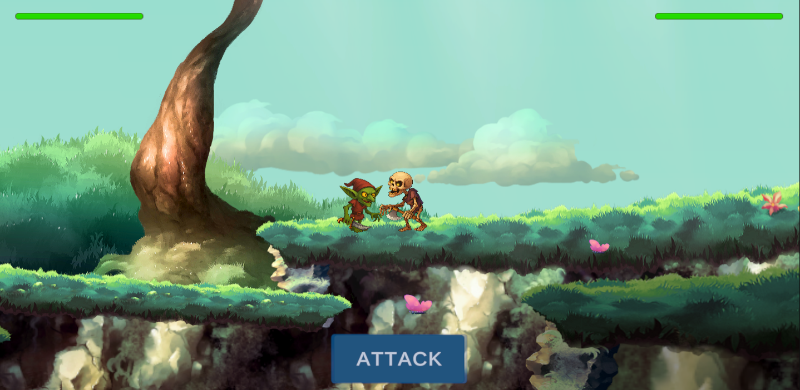
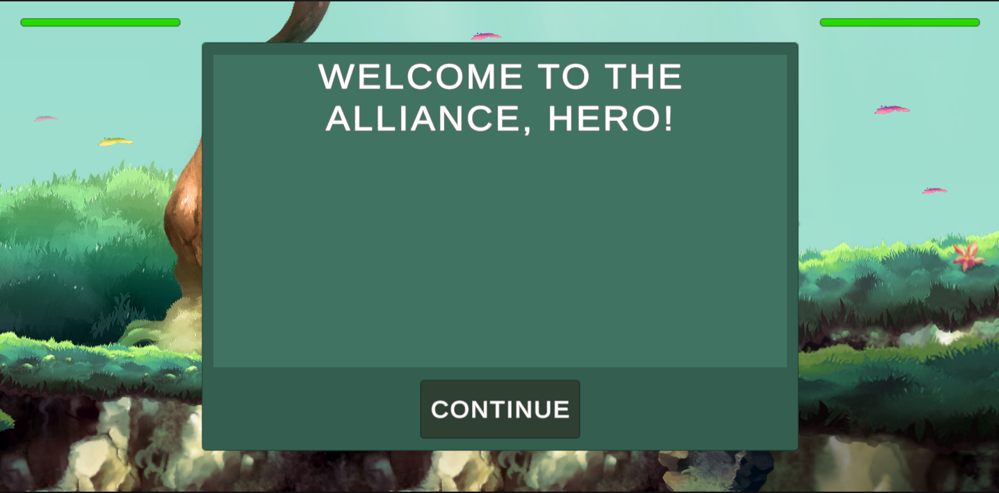
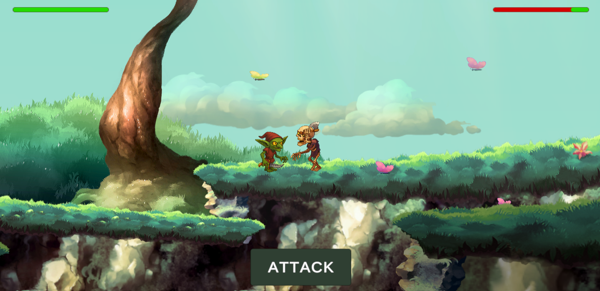
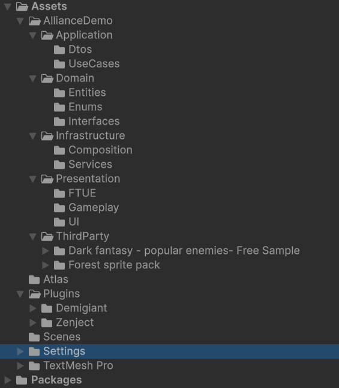

<p align="center">
  
</p>

# ⭐ Alliance FTUE Demo — Clean Unity Architecture + DI + Tweened UI

A compact demonstration of **FTUE flow + battle UI + scalable architecture**.  
Project structure follows **Clean Architecture**, UI is animated via **DOTween**, dependencies wired through **Zenject**.  
This prototype is built as production-ready foundation — easy to scale, extend and connect to real backend.

---

## 🧱 Architecture Overview

```
AllianceDemo/
  Domain/         ← Pure logic (entities, enums) – no Unity refs
  Application/    ← UseCases (battle rules, ability usage, completion)
  Infrastructure/ ← API clients/adapters (mock client now, HTTP later)
  Presentation/   ← Unity layer: MonoBehaviours, UI, FTUE, animations
```

Why this structure?

| Layer | Responsibility |
|---|---|
| **Domain** | Rules, health, damage — testable, reusable |
| **Application** | Coordinates logic through use cases |
| **Infrastructure** | Backend adapters, mock client → server-ready |
| **Presentation** | Views/UI/animations/FTUE only |

---

## 🎮 Features

- Hero vs Enemy combat
- Ability button unlocks via FTUE
- Damage + death animation flow
- Tweened UI feedback (DOTween)
- Victory popup + continue to restart
- LevelUp popup at completion

---

## 🧪 FTUE Walkthrough

1. Intro dialog → welcome
2. Ability instruction dialog
3. Highlight ability button
4. Wait for user tap
5. Enemy defeat
6. Victory + level up reward

---

## 🖼 Screenshots

### Dialog Step


### Gameplay (FTUE highlight active)


### Gameplay 02 — Attack animation


### Project Folder Structure


---

## 🌐 Backend Ready by Design

- `IAllianceApiClient` → request boundary
- `MockAllianceApiClient` → logs JSON now
- Replace with HTTP client later — no refactor required

---

## 🧩 Tech Stack

| Tech | Purpose |
|---|---|
| Unity 2021+ | Core engine |
| Zenject DI | Architecture & testability |
| DOTween | UI animation & polish |
| SOLID/DRY/KISS | Maintainable code style |

---

## 🚀 Run Instructions

1. Install DOTween & Zenject
2. Open project
3. Setup Battle scene
4. Enter Play Mode → FTUE launches

---

## 🔥 Roadmap

- Multiple enemies
- Cooldowns & ability variety
- Real backend progression sync
- Scriptable FTUE steps
- VFX + sound polish

---

## 👤 Author

**Oleksii Dolbonosov — Unity Developer / Architecture & Gameplay Systems**

---
